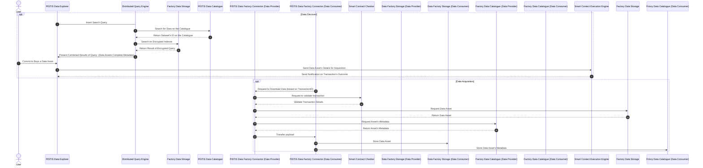

```mermaid
sequenceDiagram
    autonumber;
    actor User;

    participant PISTIS Data Explorer
    participant Distributed Query Engine
    participant Factory Data Stroage
    participant PISTIS Data Catalogue
    participant PISTIS Data Factory Connector (Data Provider)
    participant PISTIS Data Factory Connector (Data Consumer)
    participant Smart Contract Checker      
    participant Data Factory Storage (Data Provider)
    participant Data Factory Storage (Data Consumer)
    participant Factory Data Catalogue (Data Provider)  
    participant Factory Data Catalogue  (Data Consumer)  


opt Data Discover 
    PISTIS Data Explorer -> Distributed Query Engine: Insert Search Query
    Distributed Query Engine ->> PISTIS Data Catalogue: Search for Data on the Catalogue
    PISTIS Data Catalogue -->> Distributed Query Engine: Return Dataset's ID on the Catalogue
    Distributed Query Engine ->> Factory Data Stroage: Search on Encrypted Indexes       
    Factory Data Stroage -->> Distributed Query Engine: Return Result of Encrypted Query
    Distributed Query Engine ->> PISTIS Data Explorer: Present Combined Results of Query -(Data Assets Complete Metadata)
    User ->> PISTIS Data Explorer: Commit to Buys a Data Asset
    PISTIS Data Explorer ->> Smart Contect Execution Engine: Send Data Asset's Details for Acquisition
    Smart Contect Execution Engine -->> PISTIS Data Explorer: Send Notification on Transaction's Outcome
end 

opt Data Acquisition 
    PISTIS Data Factory Connector (Data Consumer) ->> PISTIS Data Factory Connector (Data Provider): Request to Download Data (based on TransactionID)
    PISTIS Data Factory Connector (Data Provider) ->> Smart Contract Checker: Request to validate transaction
    Smart Contract Checker -->> PISTIS Data Factory Connector (Data Provider): Validate Transaction Details
    PISTIS Data Factory Connector (Data Provider) ->> Factory Data Storage: Request Data Asset
    Factory Data Storage -->> PISTIS Data Factory Connector (Data Provider): Return Data Asset
    PISTIS Data Factory Connector (Data Provider) ->> Factory Data Catalogue (Data Provider): Request Asset's Metadata
    Factory Data Catalogue (Data Provider) -->> PISTIS Data Factory Connector (Data Provider): Return Asset's Metadata
    PISTIS Data Factory Connector (Data Provider) ->> PISTIS Data Factory Connector (Data Consumer): Transfer payload
    PISTIS Data Factory Connector (Data Consumer) ->> Data Factory Storage (Data Consumer): Store Data Asset
    PISTIS Data Factory Connector (Data Consumer) ->> Fctory Data Catalogue  (Data Consumer)  : Store Data Asset's Metadata
end


    
  

    
```
