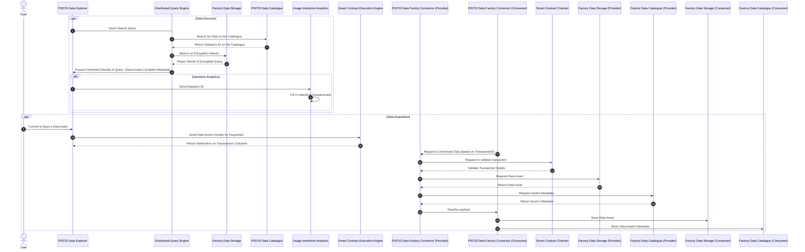

```mermaid
sequenceDiagram
    autonumber;
    actor User;

    participant PISTIS Data Explorer
    participant Distributed Query Engine
    participant Factory Data Stroage
    participant PISTIS Data Catalogue
    participant Usage Intentions Analytics
    participant Smart Contract Execution Engine
    participant PISTIS Data Factory Connector (Provider)
    participant PISTIS Data Factory Connector (Consumer)
    participant Smart Contract Checker      
    participant Factory Data Storage (Provider)
    participant Factory Data Catalogue (Provider)  
    participant Factory Data Storage (Consumer)
    participant Factory Data Catalogue (Consumer)  


opt Data Discover 
    PISTIS Data Explorer -> Distributed Query Engine: Insert Search Query
    Distributed Query Engine ->> PISTIS Data Catalogue: Search for Data on the Catalogue
    PISTIS Data Catalogue -->> Distributed Query Engine: Return Dataset's ID on the Catalogue
    Distributed Query Engine ->> Factory Data Stroage: Search on Encrypted Indexes       
    Factory Data Stroage -->> Distributed Query Engine: Return Result of Encrypted Query
    Distributed Query Engine ->> PISTIS Data Explorer: Present Combined Results of Query -(Data Assets Complete Metadata)
opt Intentions Analytics
PISTIS Data Explorer ->> Usage Intentions Analytics: Send Dataset's ID
Usage Intentions Analytics  ->> Usage Intentions Analytics: Fill in Intentions Questionnaire
end

end

opt Data Acquisition 
    User ->> PISTIS Data Explorer: Commit to Buys a Data Asset
    PISTIS Data Explorer ->> Smart Contract Execution Engine: Send Data Asset's Details for Acquisition
    Smart Contract Execution Engine -->> PISTIS Data Explorer: Return Notification on Transaction's Outcome
    PISTIS Data Factory Connector (Consumer) ->> PISTIS Data Factory Connector (Provider): Request to Download Data (based on TransactionID)
    PISTIS Data Factory Connector (Provider) ->> Smart Contract Checker: Request to validate transaction
    Smart Contract Checker -->> PISTIS Data Factory Connector (Provider): Validate Transaction Details
    PISTIS Data Factory Connector (Provider) ->> Factory Data Storage (Provider): Request Data Asset
    Factory Data Storage (Provider) -->> PISTIS Data Factory Connector (Provider): Return Data Asset
    PISTIS Data Factory Connector (Provider) ->> Factory Data Catalogue (Provider): Request Asset's Metadata
    Factory Data Catalogue (Provider) -->> PISTIS Data Factory Connector (Provider): Return Asset's Metadata
    PISTIS Data Factory Connector (Provider) ->> PISTIS Data Factory Connector (Consumer): Transfer payload
    PISTIS Data Factory Connector (Consumer) ->> Factory Data Storage (Consumer): Store Data Asset
    PISTIS Data Factory Connector (Consumer) ->> Factory Data Catalogue (Consumer): Store Data Asset's Metadata
end


    
  

    
```
