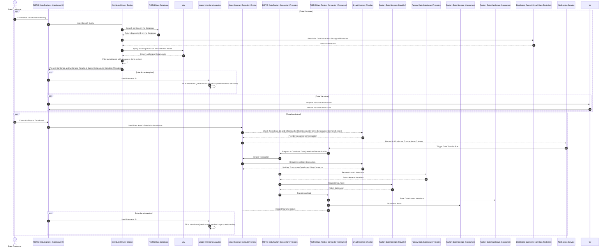

```mermaid
sequenceDiagram
    autonumber;
    actor Data Consumer;

    participant PISTIS Data Explorer (Catalogue UI)
    participant Distributed Query Engine
    participant PISTIS Data Catalogue
    participant IAM
    participant Usage Intentions Analytics
    participant Smart Contract Execution Engine
    participant PISTIS Data Factory Connector (Provider)
    participant PISTIS Data Factory Connector (Consumer)
    participant Smart Contract Checker      
    participant Factory Data Storage (Provider)
    participant Factory Data Catalogue (Provider)  
    participant Factory Data Storage (Consumer)
    participant Factory Data Catalogue (Consumer)
    participant dqlsh as Distributed Query LSH (all Data Factories)
    participant Notification Service

opt Data Discover
    Data Consumer -> PISTIS Data Explorer (Catalogue UI): Commence Data Asset Searching
    PISTIS Data Explorer (Catalogue UI) -> Distributed Query Engine: Insert Search Query
    Distributed Query Engine ->> PISTIS Data Catalogue: Search for Data on the Catalogue
    PISTIS Data Catalogue -->> Distributed Query Engine: Return Dataset's ID on the Catalogue
    Distributed Query Engine ->> dqlsh: Search for Data in the Data Storage of Factories
    dqlsh -->> Distributed Query Engine: Return Dataset's ID
    Distributed Query Engine ->> IAM: Query access policies on returned Data Assets
    IAM -->> Distributed Query Engine: Return authorized Data Assets
    Distributed Query Engine -->> Distributed Query Engine: Filter out datasets with no access rights to them
    Distributed Query Engine ->> PISTIS Data Explorer (Catalogue UI): Present Combined and Authorized Results of Query (Data Assets Complete Metadata)
opt Intentions Analytics
PISTIS Data Explorer (Catalogue UI)  ->> Usage Intentions Analytics: Send Dataset's ID
Usage Intentions Analytics  ->> Usage Intentions Analytics: Fill in Intentions Questionnaire (general questionnaire for all users)
end

opt Data Valuation
PISTIS Data Explorer (Catalogue UI)  ->> fdv: Request Data Valuation Report
fdv  ->> PISTIS Data Explorer (Catalogue UI): Return Data Valuation Score
end
end

opt Data Acquisition 
    Data Consumer ->> PISTIS Data Explorer (Catalogue UI): Commit to Buys a Data Asset
    PISTIS Data Explorer (Catalogue UI) ->> Smart Contract Execution Engine: Send Data Asset's Details for Acquisition
    Smart Contract Execution Engine -->> Smart Contract Checker: Check if asset can be sold (checking the RESALE counter set in the acquired license (if exists)
    Smart Contract Checker -->> Smart Contract Execution Engine: Provide Clearance for Transaction
    Smart Contract Execution Engine -->> Notification Service: Return Notification on Transaction's Outcome


    Notification Service ->> PISTIS Data Factory Connector (Consumer): Trigger Data Transfer flow
    PISTIS Data Factory Connector (Consumer) ->> PISTIS Data Factory Connector (Provider): Request to Download Data (based on TransactionID)
    PISTIS Data Factory Connector (Provider) ->> Smart Contract Execution Engine: Initiate Transaction
    Smart Contract Execution Engine ->> Smart Contract Checker: Request to validate transaction
    Smart Contract Checker -->> Smart Contract Execution Engine: Validate Transaction Details and Give Clearance
    PISTIS Data Factory Connector (Provider) ->> Factory Data Catalogue (Provider): Request Asset's Metadata
    Factory Data Catalogue (Provider) -->> PISTIS Data Factory Connector (Provider): Return Asset's Metadata
    PISTIS Data Factory Connector (Provider) ->> Factory Data Storage (Provider): Request Data Asset
    Factory Data Storage (Provider) -->> PISTIS Data Factory Connector (Provider): Return Data Asset
    PISTIS Data Factory Connector (Provider) ->> PISTIS Data Factory Connector (Consumer): Transfer payload
    PISTIS Data Factory Connector (Consumer) ->> Factory Data Catalogue (Consumer): Store Data Asset's Metadata
    PISTIS Data Factory Connector (Consumer) ->> Factory Data Storage (Consumer): Store Data Asset
    PISTIS Data Factory Connector (Consumer) --> Smart Contract Execution Engine: Record Transfer Details

opt Intentions Analytics
    PISTIS Data Explorer (Catalogue UI)  ->> Usage Intentions Analytics: Send Dataset's ID
    Usage Intentions Analytics  ->> Usage Intentions Analytics: Fill in Intentions Questionnaire (verified buyer questionnaire)
end
end


    
  

    
```
