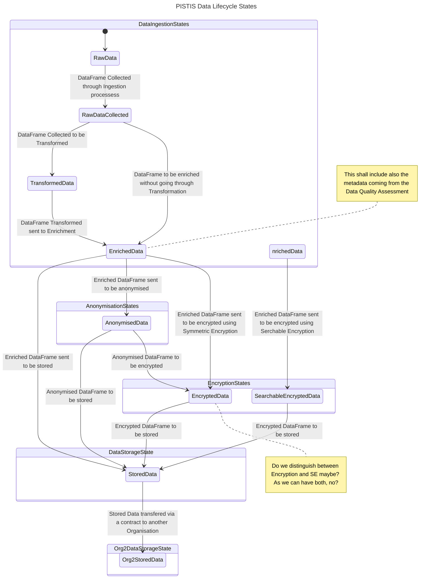

```mermaid
---
title: PISTIS Data Lifecycle States
---
stateDiagram-v2


state DataIngestionStates{
    [*] --> RawData
    RawData --> RawDataCollected: DataFrame Collected through Ingestion processess
    RawDataCollected --> TransformedData: DataFrame Collected to be Transformed
    RawDataCollected --> EnrichedData: DataFrame to be enriched without going through Transformation
    TransformedData --> EnrichedData: DataFrame Transformed sent to Enrichment 
    note left of EnrichedData : This shall include also the metadata coming from the Data Quality Assessment
    EnrichedData --> StoredData : Enriched DataFrame sent to be stored
    EnrichedData --> AnonymisedData : Enriched DataFrame sent to be anonymised
    EnrichedData --> EncryptedData : Enriched DataFrame sent to be encrypted using Symmetric Encryption
     nrichedData --> SearchableEncryptedData : Enriched DataFrame sent to be encrypted using Serchable Encryption
}

state AnonymisationStates{
AnonymisedData --> StoredData : Anonymised DataFrame to be stored
AnonymisedData --> EncryptedData : Anonymised DataFrame to be encrypted
}

state EncryptionStates{
EncryptedData --> StoredData : Encrypted DataFrame to be stored
SearchableEncryptedData --> StoredData : Encrypted DataFrame to be stored
note right of EncryptedData : Do we distinguish between Encryption and SE maybe? As we can have both, no?
}

state DataStorageState{

     StoredData --> Org2StoredData : Stored Data transfered via a contract to another Organisation
}

state Org2DataStorageState{

     Org2StoredData
}
   
```
